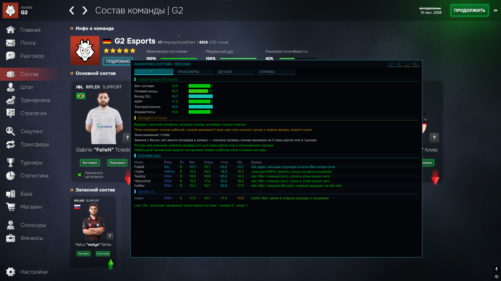
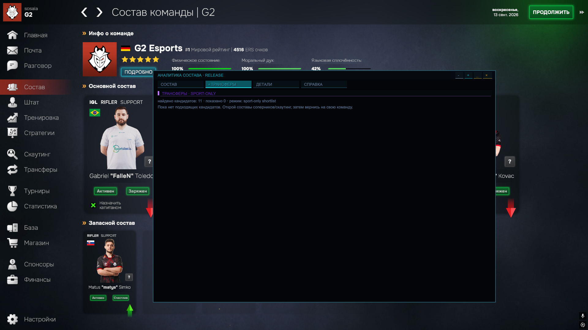

# EM Roster Intel

[English](README.md) | **Русский**

EM Roster Intel — неофициальный мод для **Esports Manager 2026**, который анализирует состав, роли игроков и слабые места команды, предлагает осторожные замены и формирует Transfer Radar. Мод работает только на чтение и не меняет сохранения или состав автоматически.

> **Важно:** Transfer Radar оценивает только спортивную целесообразность. Он не учитывает стоимость трансфера, зарплату, контракт, клаусулу, готовность клуба продать игрока и желание игрока перейти.

## Совместимость

| Компонент | Версия |
|---|---|
| Мод | `1.0.0` |
| Игра | Esports Manager 2026 |
| Проверенная версия игры | `1.0.21` |
| Unity | `6000.3.12f1` по метаданным исходного релиза |
| Загрузчик | BepInEx 6, Unity IL2CPP, Windows x64 |

Обновления игры могут изменить внутренние IL2CPP-типы и нарушить совместимость мода.

## Возможности

- анализ основы и скамейки, ролей, формы, морали и статистики;
- поиск слабого звена и общая оценка состава;
- рекомендации по заменам с учётом ролей, капитана и основного AWP;
- Transfer Radar по игрокам команд, просмотренных в текущей сессии;
- вкладки **Состав**, **Трансферы**, **Детали** и **Помощь**.

## Установка

1. Закройте игру.
2. Установите BepInEx 6 `Unity.IL2CPP-win-x64` по [официальной инструкции](https://docs.bepinex.dev/master/articles/user_guide/installation/unity_il2cpp.html).
3. Запустите игру один раз и снова закройте её.
4. Скачайте `EM.RosterIntel-v1.0.0.zip` со страницы [последнего релиза](https://github.com/endoflife1231/EM.RosterIntel/releases/latest). Автоматические архивы GitHub «Source code» для установки не подходят.
5. Распакуйте папку `EM.RosterIntel` в:

   ```text
   <ПАПКА ИГРЫ>\BepInEx\plugins\
   ```

6. Проверьте конечный путь:

   ```text
   <ПАПКА ИГРЫ>\BepInEx\plugins\EM.RosterIntel\EM.RosterIntel.dll
   ```

7. Запустите игру, откройте экран состава и нажмите `F9`, если окно скрыто.

Подробная инструкция, включая обновление, удаление и решение проблем: [docs/INSTALL-RU.md](docs/INSTALL-RU.md).

## Управление

| Действие | Клавиша |
|---|---|
| Показать или скрыть окно | `F9` |
| Переместить | перетащить верхнюю панель |
| Изменить размер | `-` / `+` |
| Свернуть или развернуть | `_` / `□` |
| Скрыть | `×` |
| Сбросить положение и размер | `Backspace` |

## Данные и безопасность

Мод не записывает данные в сохранения, не меняет состав автоматически, не вмешивается в симуляцию матчей, не содержит телеметрии или автообновления. Для наиболее полного отчёта откройте страницы статистики всех пяти игроков основы. Чтобы заполнить Transfer Radar, просмотрите составы нескольких других команд и вернитесь к своей.

## Сборка из исходников

Исходный код находится в `src/`. Для сборки нужны .NET SDK с поддержкой `net6.0`, установленная игра и BepInEx 6 Unity IL2CPP x64. Репозиторий не распространяет файлы игры, BepInEx или сгенерированные interop-сборки. Подробности: [BUILDING.md](BUILDING.md).

Исходники были восстановлены из DLL версии `1.0.0`, поэтому они не гарантируют побайтовое совпадение при повторной сборке. Подробнее: [SOURCE_NOTICE.md](SOURCE_NOTICE.md).

## Скриншоты






## Лицензия и отказ от ответственности

Исходный код распространяется по [лицензии MIT](LICENSE). Лицензия не предоставляет прав на Esports Manager 2026, BepInEx, Unity или сторонние материалы. Мод не связан с Neurona Games, indie.io, Valve, Steam или BepInEx. Используйте мод на свой риск и сохраняйте резервные копии важных сохранений.
